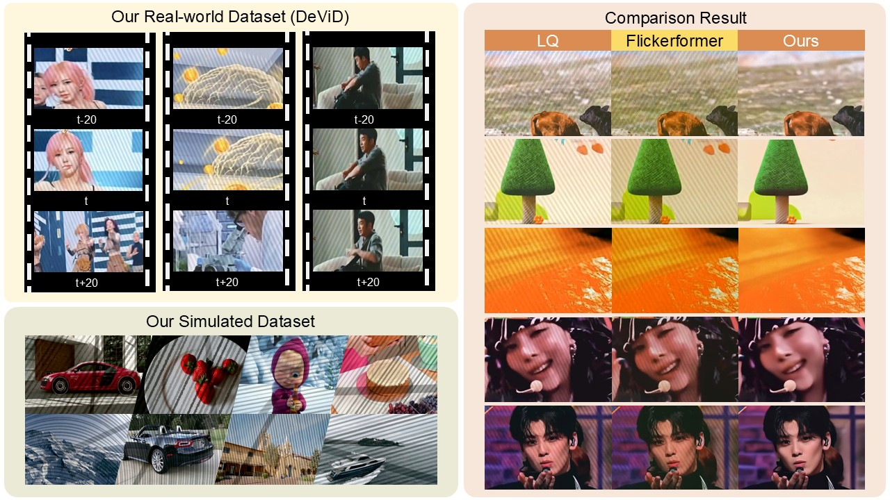
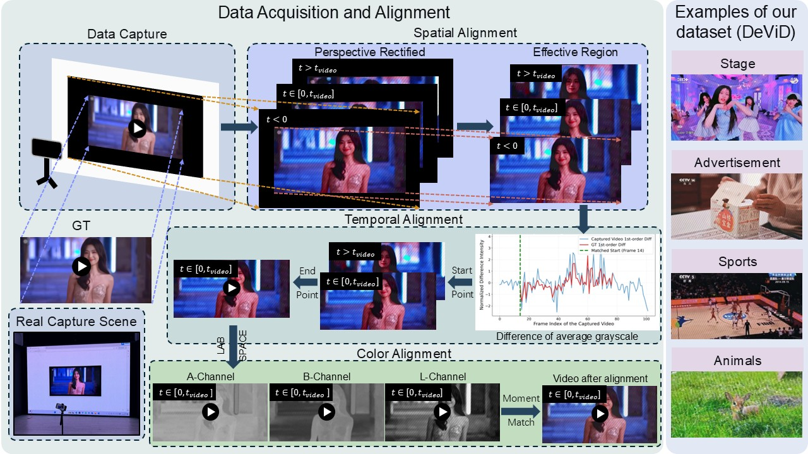
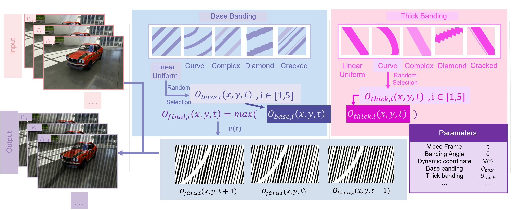
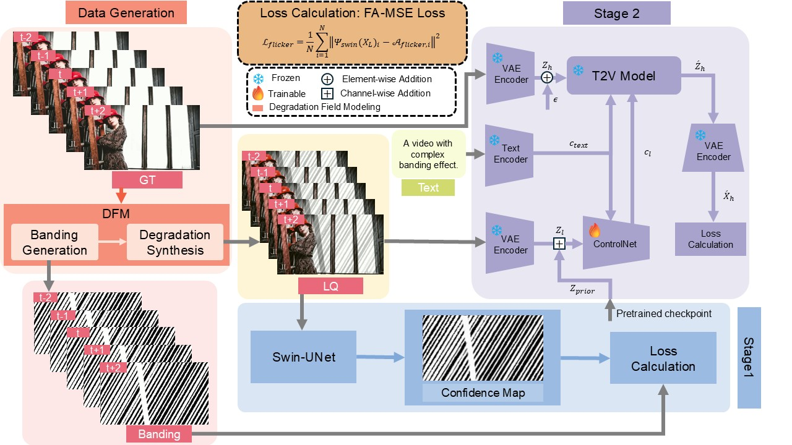
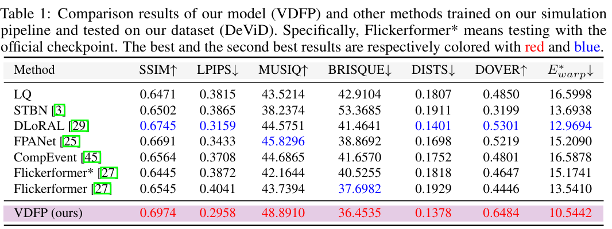
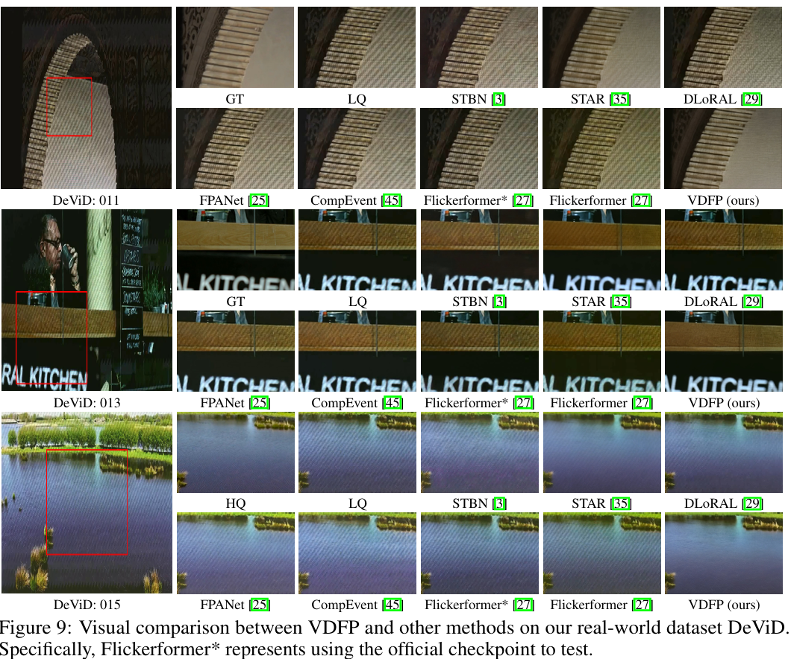

# VDFP: Video Deflickering with Flicker-banding Priors

[Zhiyi Zhou](https://github.com/ZhiyiZZhou), [Libo Zhu](https://github.com/libozhu03), [Zihan Zhou](https://github.com/ZZH-qwq), [Yulun Zhang](http://yulunzhang.com/) and [Xiaokang Yang]()
**"VDFP: Video Deflickering with Flicker-banding Priors", arxiv 2026**

[](https://ZhiyiZZhou.github.io/VDFP)
[](https://arxiv.org/abs/2605.21079)
[](https://github.com/ZhiyiZZhou/VDFP)
<!-- [](https://github.com/ZhiyiZZhou/VDFP/releases) -->
<!-- [](https://github.com/ZhiyiZZhou/VDFP) -->


<p align="center">
   
</p>

---

## 📚 Table of Contents

- [🔥 News](#-news)
- [📘 Abstract](#-abstract)
- [📝 Structure Overview](#-structure-overview)
- [⚙️ Installation](#️-installation)
- [📥 Download Pretrained Models and Datasets](#-download-pretrained-models-and-datasets)
- [🧪 Inference](#-inference)
- [🔎 Results](#-results)
- [📝 Acknowledgements](#-acknowledgements)

---

## 🔥 News
- **[2026-05-13]** Create repository.

### ⭐⭐⭐ If VDFP is helpful to your projects, please help star this repo. Thanks!


## 📘 Abstract

>  Capturing digital screens with smartphones frequently induces severe banding due to hardware synchronization mismatches. Existing video restoration methods struggle with these structured, periodic luminance fluctuations, often resulting in residual artifacts or over-smoothed textures. We firstly construct DeViD, a real-world dataset in various scenes to deal with the lack of available datasets.Then we propose VDFP (Video Deflickering with Flicker-banding Priors), a novel perception-guided generation framework. First, we introduce a Degradation Field Modeling Based on Rolling Shutter Mechanism (DFM) capable of synthesizing complex multi-banding scenarios. Second, we present a spatial-temporal continuous prior perception (CPP). Unlike traditional binary segmentation, this module is optimized via a Flicker-Aware Mean Squared Error (FA-MSE) to capture the luminance transitions. By zero-initializing an augmented input layer, our model preserves pre-trained generative priors as well as spatial-temporal prior perception. Extensive experiments demonstrate that VDFP significantly outperforms other methods, eliminating complex banding with high-fidelity spatial details and temporal consistency.


## 📝 Structure Overview
<p align="center">
   <br>
    <em>Figure 1. Overview of the data acquisition and alignment of DeViD (left) and examples of some scenes contained in DeViD.</em>
</p>


<p align="center">
   <br>
    <em>Figure 2. Overview of our data simulation pipeline.</em>
</p>


<p align="center">
   <br>
    <em>Figure 3. Overview of our model (VDFP).</em>
</p>


</details>


## ⚙️ Installation
TBD


## 📥 Download Pretrained Models and Datasets
TBD


## 🧪 Inference
TBD


## <a name="-results"></a> 🔎 Results
VDFP greatly outperformes other methods, which are trained on our simulated dataset.


<details>
<summary> 📊 Quantitative comparisons in Table 1 of the main paper (click to expand)</summary>

<p align="center">
  
</p>
</details>

<details>
<summary> 🖼 Visual comparison in Figure 9 of the main paper (click to expand)
</summary>

<p align="center">
  
</p>
</details>


## 📝 Acknowledgements
We would like to thank the developers and maintainers of [Video-SwinUNet](https://github.com/SimonZeng7108/Video-SwinUNet), [STAR](https://github.com/NJU-PCALab/STAR), and [Flickerformer](https://github.com/qulishen/Flickerformer) for their open-source contributions, which have greatly facilitated our research and development.

This project is supported in part by the Shanghai Jiao Tong University Artificial Intelligence Institute.

We also thank our collaborators and contributors for their valuable feedback and technical discussions.

## 📌 Citation

```bibtex
@article{Zhou26VDFP,
  title={{VDFP}: Video Deflickering with Flicker-banding Priors},
  author={Zhiyi, Zhou and Libo, Zhu and Zihan, Zhou and Yulun, Zhang and Xiaokang, Yang},
  journal={arXiv preprint arXiv:TBD},
  year={2026}
}
```